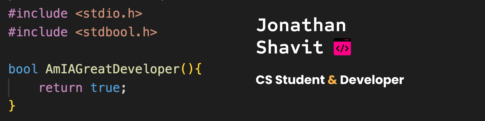

<h1>Hi 👋, I'm Jonathan</h1>
<h3 >A Computer Science Student & Developer</h3>

  

<h2> About me </h2>

It won't be an exaggeration to say that I am infatuated with the world of Computer Science - Databases, Web design, Information Security, and even Machine Learning - 
I find all of those utterly fascinating.
I am proficient in Python and C# and work well with CSS, HTML, JS, Bootstrap Jquery, React, and React Native. 
While I like to study the theoretical aspects of Computer Science, I enjoy developing and "getting my hands dirty" much more.

I have created several open-source projects in the past and I also plan to contribute to some. I believe that preserving a diverse ecosystem 
of open-source code is paramount

<h2 align="left">Connect with me:</h2>

<h2 align="left">Languages and Tools:</h2>

                

&nbsp;

